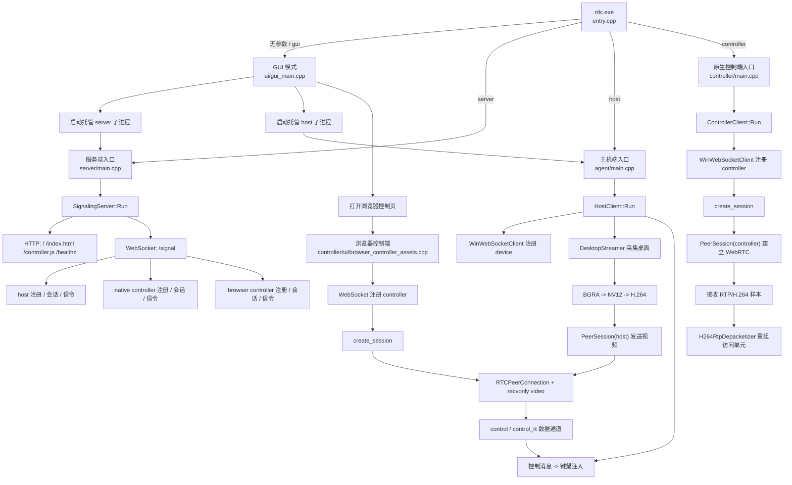

这个项目主要是为了在局域网中方便的控制其他设备，仅从浏览器端即可控制设备。目前仅保证支持 Windows 设备之间的一些简单控制

# 依赖
- mimalloc 的 VS 工程源码
- ImGUI 的 DX12 版本的 VS 工程源码
- vcpkg 进行了部分包管理器，以下是 vcpkg.json
  ```
  {
    "dependencies": [
      {
        "name": "uwebsockets",
        "features": [ "ssl", "zlib" ]
      },
      {
        "name": "libdatachannel",
        "features": [ "srtp" ]
      },
      {
        "name": "x264",
        "features": [ "chroma-format-all" ]
      },
      {
        "name": "openh264"
      }
    ]
  }
  ```


# 项目执行流程示意 


