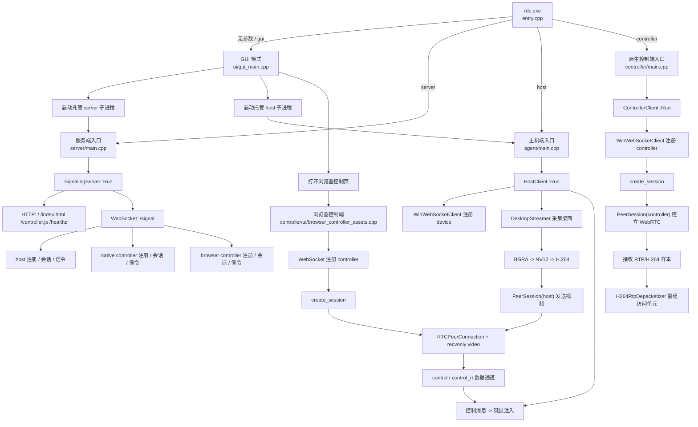

# 代码执行流程图

## 说明范围

- 本文按当前实际源码说明，不沿用旧版文档的结构。
- 统计范围是仓库自维护的源码、工程、资源和文档文件。
- 不展开第三方或产物目录：`imgui-1.92.6/`、`Debug/`、`Release/`、`x64/`、`vcpkg_installed/`、`local_test_logs/`、`.vs/`、`.git/`。
- 不展开本机/生成文件：`rdc/rdc.aps`、`rdc/rdc.vcxproj.user`。

## 文件作用与参与流程

### 1. 工程入口与构建文件

- `代码执行流程.md`：当前权威执行流程说明；不参与运行时，只负责把“入口、信令、采集、编码、WebRTC、浏览器控制”串成一份文档。
- `rdc.slnx`：解决方案入口；把 `rdc/rdc.vcxproj`、`mimalloc` 和 `imgui` 示例工程组织到一起；参与“打开工程、选择平台、触发构建”。
- `vcpkg.json`：声明 `uwebsockets`、`libdatachannel`、`x264`、`openh264` 等依赖；参与“环境准备和链接期依赖提供”。
- `rdc/LICENSE`：授权说明；不参与执行流程。
- `rdc/rdc.vcxproj`：定义当前真正会被编译进 `rdc.exe` 的源码列表、链接库、资源和包含目录；参与“把所有模块编译成一个多模式可执行文件”。这里也明确了 `signal_socket.cpp` 目前不是编译单元。
- `rdc/rdc.vcxproj.filters`：仅负责 Visual Studio 里的虚拟目录展示；不参与运行时。

### 2. 总入口与通用基础

- `rdc/entry.cpp`：统一总入口；Windows 下无参数会隐藏控制台并直接进 GUI，有参数时按 `gui`、`server`、`host`、`controller` 分发到对应 `RunMain`；参与“所有执行链的第 1 步”。
- `rdc/mimalloc_override.cpp`：把全局 `new/delete` 接到 `mimalloc`；参与“全部模块的内存分配”，但不参与业务分发。
- `rdc/protocol.hpp`：定义共享 JSON 类型、角色枚举、消息类型常量和错误封装；参与“server、host、controller、browser 的信令命名约定”。

### 3. GUI 托管启动链

- `rdc/ui/gui_main.hpp`：声明 GUI 状态、页面枚举、托管子进程句柄、D3D12/ImGui 运行对象；参与“GUI 主循环的结构定义”。
- `rdc/ui/gui_main.cpp`：实现 Windows 图形界面；负责初始化 Win32 + D3D12 + ImGui、读取表单、启动 `rdc server` 子进程、启动 `rdc host` 子进程、拼接浏览器控制页 URL 并打开默认浏览器；参与“无参数启动后的整条 GUI 托管链”。
- `rdc/ui/widgets/ui_widgets.hpp`：声明 GUI 自定义输入行、位图图标、侧边栏按钮等控件助手；参与“GUI 页面绘制层”。
- `rdc/ui/widgets/ui_widgets.cpp`：实现输入框焦点/光标定位、位图像素读取和侧边栏图标绘制；参与“GUI 交互细节和资源显示”。
- `rdc/ui/animations/ui_animations.hpp`：声明动画插值、缓动和渐进函数；参与“GUI 页面切换和数值平滑”。
- `rdc/ui/animations/ui_animations.cpp`：实现动画数学函数；参与“GUI 动画效果”。
- `rdc/read_resource.h`：声明从 Windows 资源段读取二进制数据的接口；参与“GUI 读取字体/位图资源”。
- `rdc/read_resource.cpp`：实现资源段二进制读取；参与“GUI 资源加载”。
- `rdc/resource.h`：定义字体和位图资源 ID；参与“GUI 资源索引”。
- `rdc/rdc.rc`：把字体和两张位图打进可执行文件资源段；参与“GUI 启动后图标/字体可被读取”。
- `rdc/ui/assets/home.bmp`：首页图标源文件；参与“GUI 左侧导航栏显示”。
- `rdc/ui/assets/shezhi.bmp`：设置页图标源文件；参与“GUI 左侧导航栏显示”。

### 4. 服务端执行链

- `rdc/server/main.cpp`：服务端入口；解析命令行和环境变量，校验端口/TLS 文件路径，构造 `SignalingServer` 并进入事件循环；参与“`rdc server` 启动链”。
- `rdc/server/transport/server_config.hpp`：定义 `ServerConfig`，并从 `RDC_SIGNAL_PORT`、`RDC_SIGNAL_BIND_HOST`、`RDC_SIGNAL_CERT`、`RDC_SIGNAL_KEY`、`RDC_SIGNAL_CA` 读取默认值；参与“服务端启动前配置装配”。
- `rdc/server/audit/server_logger.hpp`：声明服务端专用日志器；参与“服务端启动、连接、会话、错误日志输出”。
- `rdc/server/audit/server_logger.cpp`：实现服务端日志输出；Debug 下写控制台/文件，Release 下主要保留错误；参与“服务端运行期观测”。
- `rdc/server/signaling_gateway/signaling_server.hpp`：声明连接上下文、设备记录、会话记录和全部消息处理函数；参与“服务端信令状态机定义”。
- `rdc/server/signaling_gateway/signaling_server.cpp`：服务端核心实现；注册 `/`、`/index.html`、`/controller.js`、`/healthz`、`/signal` 路由，处理 `register_device`、`register_controller`、`list_devices`、`create_session`、`accept_session`、`reject_session`、`signal`、`close_session`，并在断线时清理设备/控制端/会话；参与“浏览器页面分发”和“host/controller/browser 全部信令转发”。

### 5. 主机端执行链

- `rdc/agent/main.cpp`：主机端入口；用 `signal_url + device_id` 构造 `HostClient` 并运行；参与“`rdc host` 启动链”。
- `rdc/agent/session/host_client.hpp`：声明主机端运行时状态、会话表、输入派发线程、输出范围和信令处理接口；参与“主机端主控对象定义”。
- `rdc/agent/session/host_client.cpp`：主机端核心实现；负责连接信令服务并 `register_device`，收到 `session_request` 时创建 `PeerSession(host)` 并回 `accept_session`，收到 `signal` 时继续 WebRTC 协商，收到控制消息时走数据通道或信令兜底路径，再把键鼠事件排队注入本机；同时启动 `DesktopStreamer` 做桌面采集和编码；参与“主机端的整条业务主链”。
- `rdc/agent/session/desktop_streamer.hpp`：声明桌面推流器配置和工作线程；参与“采集/编码模块装配”。
- `rdc/agent/session/desktop_streamer.cpp`：桌面推流器核心实现；只有在存在可发送视频的活动会话时才采集，执行 DXGI 捕获 -> D3D11 回读 -> BGRA 转 NV12 -> H.264 编码 -> 分发到所有可发送的 `PeerSession`，并根据 PLI 触发关键帧，同时主动丢弃旧帧保持低时延；参与“主机端视频生产链”。
- `rdc/agent/rtc/peer_session.hpp`：声明 host/controller 共用的 WebRTC 对等会话类；参与“Offer/Answer、ICE、数据通道、视频轨、媒体收发接口定义”。
- `rdc/agent/rtc/peer_session.cpp`：实现 WebRTC 会话；Controller 侧创建 `control` 数据通道和 `recvonly video`，Host 侧根据远端 Offer 选择 H.264 payload/profile、建立发送视频轨、处理 ICE、管理 RTP 时间戳、接收 PLI 请求关键帧、必要时改写关键帧 SPS 的 `profile-level-id`，并在数据通道/视频轨回调中把消息回交上层；参与“host/controller/browser 建链”和“已编码视频发送/媒体样本接收”。
- `rdc/agent/capture/desktop_capturer.hpp`：定义桌面采集抽象接口；参与“采集层抽象”。
- `rdc/agent/capture/desktop_frame.hpp`：定义 GPU 桌面帧结构、脏矩形和移动矩形；参与“DXGI 捕获结果描述”。
- `rdc/agent/encoder/raw_video_frame.hpp`：定义 CPU 侧原始 BGRA 帧；参与“回读后待转换帧描述”。
- `rdc/agent/encoder/nv12_video_frame.hpp`：定义 NV12 帧；参与“H.264 编码输入格式描述”。
- `rdc/agent/encoder/encoded_video_frame.hpp`：定义 H.264 编码结果，包含字节流、关键帧标记、时间戳和时长；参与“编码输出到 WebRTC 发送链”。
- `rdc/agent/encoder/bgra_to_nv12_converter.hpp`：声明 BGRA -> NV12 转换器；参与“编码前像素格式转换”。
- `rdc/agent/encoder/bgra_to_nv12_converter.cpp`：实现 BGRA -> NV12 转换；参与“桌面帧从 CPU BGRA 到编码器输入 NV12 的桥接”。
- `rdc/agent/platform/windows/dxgi_desktop_duplicator.hpp`：声明 DXGI Desktop Duplication 捕获器；参与“主机端 GPU 桌面抓取”。
- `rdc/agent/platform/windows/dxgi_desktop_duplicator.cpp`：实现桌面捕获、超时处理、丢失访问后的 duplication 重建，以及脏区/位移区提取；参与“桌面采集链的第一段”。
- `rdc/agent/platform/windows/d3d11_desktop_frame_reader.hpp`：声明 D3D11 桌面帧回读器；参与“GPU 纹理到 CPU 字节流转换”。
- `rdc/agent/platform/windows/d3d11_desktop_frame_reader.cpp`：把 DXGI 捕获到的 `ID3D11Texture2D` 复制到 staging 纹理并映射成 BGRA 字节流；参与“桌面采集链的第二段”。
- `rdc/agent/platform/windows/h264_encoder_types.hpp`：定义编码后端枚举和编码配置；参与“编码器选择和参数装配”。
- `rdc/agent/platform/windows/h264_video_encoder.hpp`：声明统一 H.264 编码器包装器；参与“Media Foundation 和 x264 的统一调用口”。
- `rdc/agent/platform/windows/h264_video_encoder.cpp`：实现编码器选择逻辑；`Auto` 时先尝试 Media Foundation，初始化或运行中失败再回退到 x264；参与“主机端编码后端切换”。
- `rdc/agent/platform/windows/mf_h264_encoder.hpp`：声明 Media Foundation H.264 编码器；参与“Windows 原生编码路径定义”。
- `rdc/agent/platform/windows/mf_h264_encoder.cpp`：实现 MF 编码器创建、输入输出 media type、低时延配置、关键帧请求和样本拉取；参与“主机端首选编码路径”。
- `rdc/agent/platform/windows/x264_h264_encoder.hpp`：声明 x264 编码器；参与“软件编码兜底路径定义”。
- `rdc/agent/platform/windows/x264_h264_encoder.cpp`：实现 x264 编码和关键帧控制；参与“主机端软件编码兜底路径”。

### 6. 原生控制端与浏览器控制端执行链

- `rdc/controller/main.cpp`：原生控制端入口；用 `signal_url + user_id + target_device_id` 构造 `ControllerClient` 并运行；参与“`rdc controller` 启动链”。
- `rdc/controller/rtc/controller_client.hpp`：声明原生控制端状态，包括信令客户端、`PeerSession`、RTP 去封装器和访问单元缓存；参与“原生控制端主控对象定义”。
- `rdc/controller/rtc/controller_client.cpp`：原生控制端核心实现；连接信令并 `register_controller`，随后 `create_session`，在 `session_accepted` 后创建 `PeerSession(controller)`，把收到的视频样本先按 RTP 解析，再交给 `H264RtpDepacketizer` 重组访问单元；当前主链只做“收到完整访问单元后的日志确认”，没有继续接解码/渲染；参与“原生控制端建链与媒体接收”。
- `rdc/controller/rtc/h264_rtp_depacketizer.hpp`：实现 H.264 RTP 去封装，支持单 NAL、STAP-A 和 FU-A；参与“原生控制端视频样本重组”。
- `rdc/controller/ui/browser_controller_assets.hpp`：声明嵌入式 HTML/JS 资源读取接口；参与“服务端页面返回”。
- `rdc/controller/ui/browser_controller_assets.cpp`：提供浏览器控制页 HTML 和 `controller.js`；页面逻辑包括：注册 controller、`list_devices`、`create_session`、创建 `RTCPeerConnection`、接收远端 video track、创建 `control`/`control_rt` 数据通道、采集键盘/鼠标/滚轮事件并优先走 RTC 数据通道、必要时退回信令转发控制；参与“浏览器控制端整条主链”。
- `rdc/controller/renderer/decoded_video_frame.hpp`：定义解码后 BGRA 帧结构；参与“原生显示链的数据模型”，当前不在主链。
- `rdc/controller/renderer/openh264_video_decoder.hpp`：声明 OpenH264 解码器；参与“原生显示链定义”，当前不在主链。
- `rdc/controller/renderer/openh264_video_decoder.cpp`：把 H.264 访问单元解码成 BGRA 帧；参与“原生显示链解码阶段”，当前未被 `controller/main.cpp` 接入。
- `rdc/controller/renderer/desktop_window_renderer.hpp`：声明 Win32 窗口渲染器；参与“原生显示链定义”，当前不在主链。
- `rdc/controller/renderer/desktop_window_renderer.cpp`：实现窗口线程、绘制和关闭回调；参与“原生显示链渲染阶段”，当前未被 `controller/main.cpp` 接入。

### 7. 公共协议、传输与工具文件

- `rdc/protocol/common/win_websocket_client.hpp`：声明基于 WinHTTP 的 WebSocket 客户端；参与“host/controller 原生端信令传输”。
- `rdc/protocol/common/win_websocket_client.cpp`：实现 `ws://` / `wss://` 解析、握手、发送 JSON、接收线程和 JSON 分发；参与“host/controller 原生端与 `/signal` 通信”。
- `rdc/protocol/common/console_logger.hpp`：声明共享日志接口；参与“原生端和部分公共模块日志输出”。
- `rdc/protocol/common/console_logger.cpp`：实现调试期控制台日志和 Release 错误日志文件；参与“原生端运行期观测”。
- `rdc/protocol/common/json_utils.hpp`：提供 JSON 字段读取和 map 查找助手；参与“server/host/controller 的消息解析”。
- `rdc/protocol/common/buffer_utils.hpp`：提供缓冲区追加、扩容、逐行复制、批量 reset 等模板助手；参与“编码、解码、RTP 重组、桌面回读”等字节操作。
- `rdc/protocol/common/video_convert_utils.hpp`：提供颜色空间转换工具；被 `bgra_to_nv12_converter.cpp` 和 `openh264_video_decoder.cpp` 复用；参与“编码前像素转换”和“解码后像素转换”。
- `rdc/protocol/common/rtc_handle_utils.hpp`：提供 libdatachannel 句柄回调绑定助手；当前主链不是核心依赖，但属于 WebRTC 封装备用工具。
- `rdc/protocol/common/json_types.hpp`：只是对共享 JSON 类型的再导出；不额外承载逻辑。
- `rdc/protocol/control/control_protocol.hpp`：定义 `ping` / `pong` 控制消息构造辅助；参与“控制通道协议约定”，当前多数调用点直接手写 JSON。
- `rdc/protocol/signaling/signaling_protocol.hpp`：只是对公共信令协议头的再导出；不额外承载逻辑。

### 8. 预留文件与补充文档

- `rdc/signal_socket.hpp`：声明一个基于 libdatachannel WebSocket 的旧版信令包装器；当前不是主链。
- `rdc/signal_socket.cpp`：实现旧版 `SignalSocket`；`rdc/rdc.vcxproj` 把它标成 `None`，所以当前不会编译进 `rdc.exe`，现网逻辑已改用 `WinWebSocketClient`。
- `rdc/docs/architecture.md`：旧版总体架构摘要；可作背景材料，但不是当前最完整的执行说明。
- `rdc/docs/protocol.md`：旧版协议摘要；描述了早期的消息类型集合，不负责当前主链说明。
- `rdc/docs/sequence.md`：旧版时序摘要；可以做快速回顾，但细节不如本文完整。

## 当前主执行链一句话总结

- `entry.cpp` 决定进入 GUI、server、host 或 native controller。
- GUI 模式会托管拉起 `server` 和 `host`，再打开浏览器控制页。
- `server/signaling_gateway/signaling_server.cpp` 同时承担 HTTP 页面分发和 `/signal` 信令中转。
- `agent/session/host_client.cpp` + `agent/session/desktop_streamer.cpp` 负责主机注册、接会话、采集桌面、编码 H.264、通过 `PeerSession` 发到 WebRTC 视频轨。
- 浏览器控制页通过 `controller/ui/browser_controller_assets.cpp` 内嵌脚本完成注册、建会话、建立 `RTCPeerConnection`、播放远端视频，并把键鼠事件回传到主机端。
- 原生 `controller/main.cpp` 目前能完整走到“收到 RTP/H.264 并重组访问单元”，但“解码 + 本地显示”对应的 `controller/renderer/*` 还没有接进当前主链。
